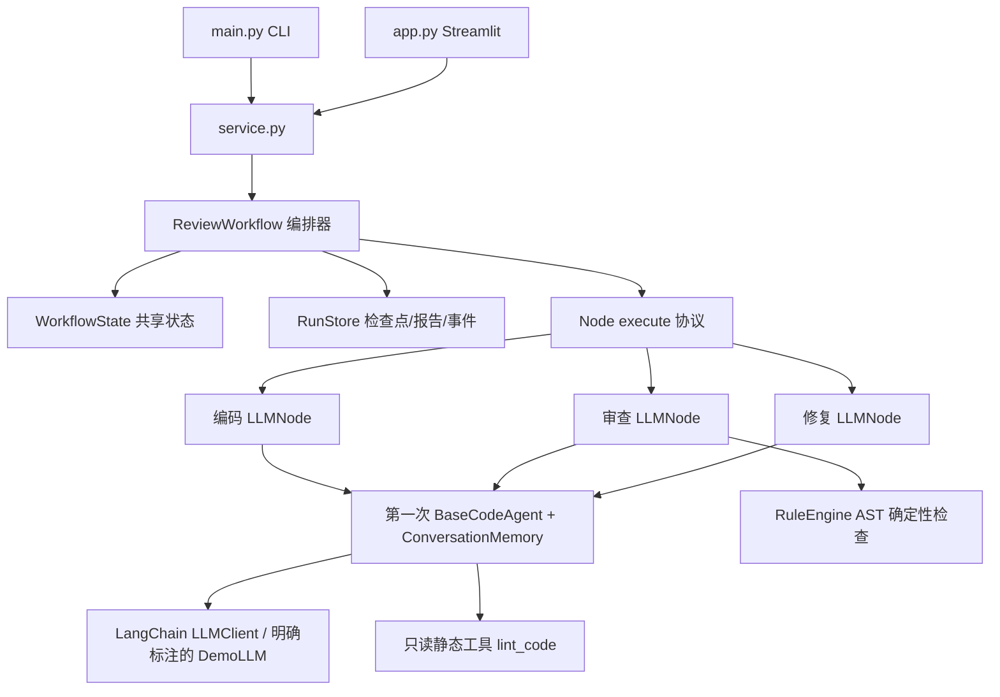

# 三 Agent 代码审查 Workflow 设计

## 目标与范围

本作业把第一次的单 Agent ReAct 能力变为有状态协作流程。MVP 使用三个角色，以 Python 源码为交换产物；支持顺序节点、条件分支、有限修复循环和失败检查点。CLI 与 Web 共用服务层，不依赖第一次项目后台。

## 架构

复用的 code_analyzer 与 codemate 为第一次作业 Python 模块快照。保留包内兼容依赖，但仅调用三角色节点、底座、模型、工具及规则引擎，不执行第一次的多专家审查流程。

## 节点职责与接口

所有节点实现 `execute(payload: dict, on_step=None) -> dict`。编排器不依赖具体 LLM SDK，测试可注入 ScriptedLLM，离线演示可注入 DemoLLM。

| 节点 | 输入 | 校验后的输出 | 下游 |
| --- | --- | --- | --- |
| code | requirement、source_code | code、summary；代码 AST 可解析 | review |
| review | requirement、当前 code、revision | summary、issues；枚举/行号合法；并入静态结果 | 无问题结束，否则 fix 或超限结束 |
| fix | requirement、当前 code、issues | 完整新 code、summary；代码 AST 可解析 | review |

角色 Prompt 要求输出单个 JSON 对象，适配器允许标准 JSON 代码围栏，但不在任意散文中猜测 JSON。错误格式直接失败，避免默默吞掉问题。修复后的结果必须复审才能 completed。

## 状态与消息

WorkflowState 以 Pydantic 定义，包含运行 ID、模式、需求、原始/当前源码、版本数组、问题、摘要、消息、事件、下一节点、状态、次数和错误。列表用 default_factory，每个任务互不共享可变容器。

AgentMessage 是交接信封：sender、receiver、revision、timestamp 与 payload。首条 user → code；之后依次 code → review、review → fix、fix → review。payload 保存交接时的数据，便于事后查看当时所见版本。消息不是外部网络通信或多进程队列，而是单进程内显式交接并落盘。

节点内 memory 保存一次 ReAct 调用的 system/user/assistant/tool 消息；执行前清空内部历史。跨节点记忆由 WorkflowState 提供，失败恢复不依赖内存对象。

## 控制与提交边界

编排器按 next_node 查注册节点，每次只执行一个。code/fix 顺序路由通过 routes 配置；review 根据问题和 repairs 条件分支。输出校验成功后更新源码/版本/问题及次数，再保存 node_completed 检查点。

max_repairs 是成功修复次数上限；max_steps 是整个任务累计成功节点上限；Agent 内另有 max_iterations 限制。达到上限置 needs_attention，保留当前版本与问题，不声称通过。失败调用不计为成功节点，只允许使用者发起恢复。

## 失败与恢复

运行/配置/输出失败置 failed，next_node 保持失败节点。恢复加载 state.json 后继续；成功编码、修复节点不重复执行。比如 code 成功、review 网络失败，恢复从 review 开始。失败输入或语法不合法不会被写入当前 code。

LLMClient 对连接、超时、限流和服务器异常按 Tenacity 策略重试至多三次；认证/输入等不适合自动重试的异常直接交给流程失败处理。节点输出不合法也不自动消耗多次付费调用，用户修正模型/配置后恢复。

RunStore 校验运行 ID 格式，检查解析路径归属，检查 state.run_id 与目录一致。state.json 采用同目录临时文件替换。事件、报告与源码是衍生产物，恢复的权威输入是 state.json。单机单用户不提供同一 ID 的并发锁，也不承诺进程崩溃后恰好执行一次：若模型响应后尚未提交就中断，恢复可能重复该次调用。

## 安全与正确性边界

工作流仅注册 lint_code，强制禁止任意代码执行。CLI 输入文件限制项目目录、.py 与 100KB；输出不覆盖初始文件。静态分析不是完整符号执行，LLM 审查不是正确性证明。completed 只说明当前审查没有剩余问题；报告和 UI 明确说明没有运行生成代码测试。

状态保存需求和源码，应视为用户本地数据；提交压缩包排除 runs 和 .env。不持久化密钥或服务配置。真实模型会接收任务源码，应按服务商与作业输入要求使用。

## 扩展与取舍

新增遵循 code/summary 契约的生成节点可注册到 agents，并修改 routes，例如 code → format → review。增加测试 Agent 或不同产物时，应新增强类型输出、共享状态字段与相应条件路由。当前 review 分支是领域特定实现，不是任意 DAG 引擎。

本次选择顺序执行以简化一致性，循环复用 review 角色而非增加第四个 Agent。固定演示使用同一节点适配器与编排器，仅替换 LLM，实现可重复的端到端检验。Web 图是观察面板，不提供拖拽编排。

## Codex 风格本地工作区

新增 `web/server.py` 与 `web/static/`，使用 FastAPI 提供同源 API，原生 HTML/CSS/JS 提供三栏工作区，保留 CLI 和 Streamlit。工作区将提交交给 ThreadPoolExecutor，最多执行两个不同任务；每个任务内部仍是三个 Agent 顺序协作。前端轮询状态，展示时间线、代码、统一差异、问题和事件，支持导出、历史与失败恢复。

RunManager 用进程内锁防止同运行重复启动。提交前完成配置与输入校验；重启时只把带 workspace_accepted 标记的中断任务置为 failed，保留 CLI 任务，恢复从 next_node 继续。前端用请求代号防止旧异步响应覆盖新页面，用退避轮询处理暂时断线。外部 Origin 的写请求被拒绝，用户和模型内容用 textContent 展示，不插入 HTML。

该工作区是单进程本地应用，应以 127.0.0.1 监听，不多开 worker，不与 CLI 同时恢复同一 ID。模型配置仅向前端返回是否已配置与模型名，密钥只在服务端 .env。布局、接口与测试详见 ui-plan.md 和验证记录。

## 自然语言、文件与最终导出

`web/inputs.py` 负责文件名、字节上限、Python 编码解码、意图短语路由与导出编码声明。`POST /api/files?filename=...` 流式读取原始字节，超过 100KB 即拒绝，返回文件名与 Unicode 源码，不写到源码目录。RunInput/WorkflowState 增加 source_filename 与 intent，交接消息保留这两个字段。

无源码的自然语言需求走生成流程；有源码默认审查修复，空需求生成默认需求。明确只审查短语或修复次数为 0 时置 review_only/max_repairs=0。编码适配器对已有源码仅静态验证并原样交接，不调用生成模型，避免只审查也改写文件。后续修复仍由 LLM 驱动。

`GET /api/runs/{id}/export` 只接受 completed 且有源码的任务，以 Content-Disposition 返回 UTF-8 附件；文件名经验证与 RFC5987 转义。导出规范化首两行编码 cookie，保持 Python 解码语义。前端采用原生附件下载；上传/新建/模式切换用版本号隔离旧响应，上传期间关闭源码编辑。

## 验证策略

先编写失败测试再实现流程。测试注入可控模型覆盖交接、恢复、状态上限及错误输出；真实 lint 工具协议用模型桩触发；CLI 子进程和 Streamlit AppTest 覆盖端到端离线路径。真实模型验证另行记录，无法由离线桩代替真实服务可用性。
