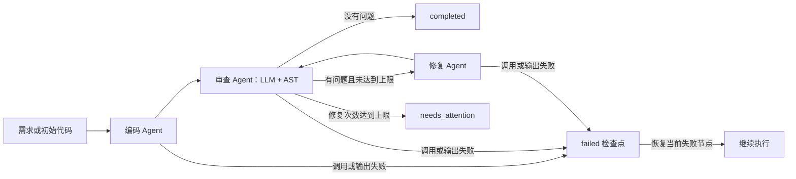
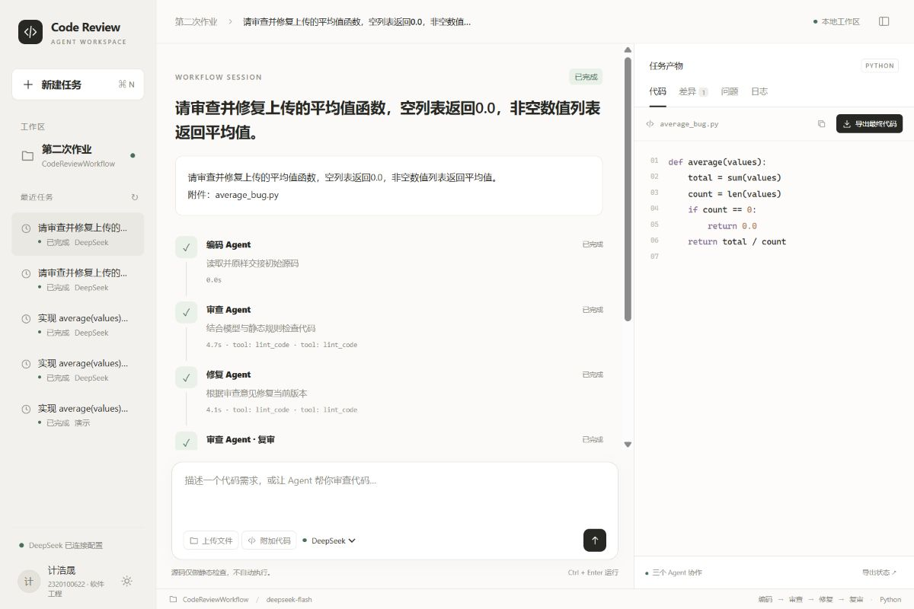

# 第二次作业：三 Agent 代码审查 Workflow

作者：2320100622 计浩晟。方向：代码审查流程。语言：Python；Agent 底座：LangChain；交互：CLI、FastAPI 工作区、Streamlit。

本项目在第一次作业的代码助手基础上，增加工作流编排层。编码 Agent 生成初始 Python 代码，审查 Agent 汇总 LLM 与 AST 静态检查问题，修复 Agent 修改源码，再由同一个审查 Agent 复审。三个角色各有独立 Prompt、工具和节点内记忆，通过显式消息与持久化共享状态协作。

支持真实模型与无需 API Key 的离线演示。**离线演示仅是固定平均值示例，用于验证编排，不具有通用生成能力。** 真实模式才会根据用户需求调用模型。

## 1. 功能与作业要求

| 作业要求 | 实现位置 | 可观察证据 |
| --- | --- | --- |
| 至少两个 Agent 协作 | `workflow/agents.py` 的 code、review、fix | 演示依次执行四个节点，复审复用 review |
| 消息传递或状态共享 | `workflow/state.py` | messages 带 sender、receiver、payload、revision；state.json 保存结果 |
| 顺序执行完整流程 | `workflow/engine.py` | 节点完成后再路由到下一个节点 |
| 条件分支与循环 | review → fix → review | 无问题跳过修复；有问题在次数内循环 |
| 执行日志与状态追踪 | events.jsonl、Web 状态面板 | 展示开始、工具调用、完成、失败事件 |
| 错误处理与恢复 | failed 检查点 + `--resume` | 失败节点重跑，成功节点不重复执行 |
| 复用第一次作业 | code_analyzer、codemate | 复用模型、ReAct 基类、工具、AST 检查 |

## 2. 工作流程



编码节点收到初始源码时保留原样，将缺陷交给审查和修复处理；没有初始源码时根据需求生成代码。因此可直观看到已有代码的修复过程。每次编码/修复输出均通过 JSON、Pydantic 与 Python AST 与静态编译校验后才保存为新版本。审查的行号必须存在，静态检查问题不会因模型返回空数组而被忽略。

## 3. 目录

```text
CodeReviewWorkflow/
├── main.py                   # 命令行
├── app.py                    # Streamlit 面板
├── web/server.py             # FastAPI 本地工作区 API / 后台任务管理
├── web/static/               # Codex 风格三栏界面，无需 Node 构建
├── workflow/
│   ├── agents.py             # 三个角色、输出契约、节点协议
│   ├── engine.py             # 顺序路由、循环、失败恢复
│   ├── state.py              # 状态、消息、事件契约
│   ├── storage.py            # 原子检查点、日志、报告
│   ├── service.py            # CLI/Web 共用构造
│   └── demo.py               # 明确标注的固定离线模拟
├── code_analyzer/            # 第一次作业复用模块快照
├── codemate/                 # 第一次作业复用工具快照
├── samples/average_bug.py     # 待审查样例
├── tests/                    # 流程与交互测试
├── docs/implementation-plan.md
├── README.md
├── Design.md                 # 详细设计
├── Desgin.md                 # 作业拼写兼容入口
├── requirements.txt
└── .env.example              # 配置模板，无真实密钥
```

复用包保留第一次项目的其他模块以兼容包内导入，但工作流只注册 **code、review、fix 三个节点**，不会执行第一次项目的多专家 pipeline。两次作业代码独立，修改本项目不会更改第一次。

## 4. 安装与快速演示

建议 Python 3.10 及以上。以下命令在本项目根目录执行：

```powershell
cd E:\python_project\SE\第二次\CodeReviewWorkflow
python -m venv .venv
.\.venv\Scripts\python.exe -m pip install -r requirements.txt
.\.venv\Scripts\python.exe main.py --demo
```

也可以使用已安装依赖的 Python：

```powershell
E:\my_python\python.exe main.py --demo
```

演示需求：数值列表平均值，空列表返回 0.0。初始代码直接除以列表长度。预期执行顺序为 `code → review → fix → review`，最终 `completed`，`repairs=1`。演示不访问网络，不收费；不能同时传入自定义 `--requirement` 或 `--file`。

## 5. Web 界面

```powershell
python -m uvicorn web.server:app --host 127.0.0.1 --port 8560
```

打开 <http://127.0.0.1:8560>，进入 Codex 风格编码工作区：左侧项目和任务历史、中间需求输入及 Agent 时间线、右侧代码/差异/问题/日志。支持浅色/深色切换、窄屏侧栏和结果面板、代码复制、下载源码及导出状态。

配置有效密钥时默认真实 DeepSeek 模式；没有配置时默认离线演示。直接用自然语言描述需求，再点击输入框右下角箭头或按 Ctrl+Enter 启动，无需填写节点配置。也可点击示例卡片。服务端不会把 API Key 返回给浏览器。

**代码文件上传**：点击“上传文件”选择一个 `.py` 文件，最大 100KB，支持 UTF-8、UTF-8 BOM 和 Python 首两行声明的编码（例如 GBK）。成功后显示文件名与源码，可继续编辑或移除。上传期间禁止编辑源码，避免文件读取覆盖手动输入。只读取内容，不执行文件，不覆盖本机原始文件。一次处理一个文件，不支持压缩包或完整多文件仓库上传。“附加代码”仍可手动粘贴。

**自然语言触发**：没有初始代码时生成；有上传/粘贴代码时审查并修复。仅上传源码不填需求也可启动，系统使用默认审查修复需求。明确“只审查”“仅检查”“不要修改代码”或 `review only` 时关闭修复。示例：

- “实现一个稳定去重函数，保留首次出现顺序。” → 生成 → 审查 → 必要时修复。
- 上传 average_bug.py，输入“审查并修复这个函数，空列表返回0.0。” → 原文交接 → 审查 → 修复 → 复审。
- 上传源码，输入“只审查，不要修改代码。” → 原文交接 → 审查，发现问题则保留待处理结果。

已有源码由编码节点确定性交接，不会在初次审查前被模型改写。意图路由使用明确短语规则，其他代码需求由角色 Prompt 处理；不是通用对话机器人或任意流程生成器。

**最终代码导出**：复审无剩余问题、状态为 completed 后，“导出最终代码”启用。下载 `.py` 附件：上传任务保留原文件名，生成任务使用 final_code.py。输出统一为 UTF-8，并同步规范化 Python 编码声明，避免原 GBK 中文损坏。failed、running、needs_attention 不能导出为“最终代码”，仍可查看源码和导出状态。

离线演示只处理固定示例，不支持自定义上传，在输入框下方明确标注。

工作区后台执行任务并轮询检查点；可同时运行最多两个独立任务。切换历史不会停止后台任务；新建任务也不会取消已提交任务。失败任务显示“从失败节点恢复”，同一任务禁止重复恢复。服务中断后，工作区任务启动时标记为 failed 并可恢复；CLI 创建的检查点保持独立。单进程服务不要带 `--workers` 多开，也不要让 CLI 和 Web 同时恢复同一个运行 ID。



保留原来的 Streamlit 状态面板，需使用其他端口避免与新工作区冲突：

```powershell
python -m streamlit run app.py --server.address 127.0.0.1 --server.port 8561
```

Streamlit 提供流程图、显式消息、代码版本等教学观察视图，默认离线演示。两种 Web 均为单用户本地程序，监听本机地址。

## 6. 真实模型配置

```powershell
Copy-Item .env.example .env
```

编辑 `.env`，设置已开通服务对应的密钥、服务地址与模型标识。示例：

```dotenv
DEEPSEEK_API_KEY=your_actual_key
DEEPSEEK_BASE_URL=https://api.deepseek.com/v1
DEEPSEEK_MODEL=deepseek-flash
AGENT_TIMEOUT=60
AGENT_MAX_ITERATIONS=10
AGENT_ALLOW_EXECUTION=0
```

也支持 `OPENAI_API_KEY`、`OPENAI_MODEL`；若仅配置 OpenAI Key，使用复用模块的 OpenAI 默认地址。兼容服务可配置 `DEEPSEEK_BASE_URL` 与对应的模型标识。两类 Key 同时存在时优先使用 DeepSeek 配置。不要提交 `.env`，环境变量优先于 dotenv 文件。这里的参数名来自第一次项目，底层统一由 LangChain ChatOpenAI 调用。

模型名参考 [DeepSeek 官方首次调用文档](https://api-docs.deepseek.com/zh-cn/)。本机已配置用户提供的 Key，真实流程验证见 [验证记录](docs/verification.md)；提交包只含占位模板，接收者仍须自行配置。修改 .env 后重启正在运行的 Web 服务，使配置重新加载。

Workflow 强制关闭代码执行，只为三个 Agent 注册 `lint_code` 静态分析工具，即使 `.env` 请求允许执行也不会在本流程中开放执行。模型网络错误按照复用客户端的选择性重试策略处理；鉴权失败需要修正配置再恢复。

真实使用例子：

```powershell
python main.py --requirement "实现 average(values)，空列表返回0.0" --file samples/average_bug.py
python main.py --requirement "实现一个把字符串列表按长度排序的函数，空列表返回空列表"
python main.py --requirement "审查平均值函数" --file samples/average_bug.py --max-repairs 3
```

`--file` 只读取项目根目录以内的 `.py` 文件（不超过 100KB），不会覆盖原文件。模型生成结果保存到运行目录，需要使用者自行审阅。每个节点可能发生多次模型调用和工具调用，真实调用由服务商计费。

## 7. 状态、日志与输出

每次运行分配 32 位十六进制 UUID，默认写入 `runs/<运行ID>/`：

| 文件 | 内容 |
| --- | --- |
| state.json | 完整检查点：需求、代码版本、问题、消息、事件、下一节点、次数 |
| events.jsonl | 每行一个结构化事件，恢复时重写完整事件历史避免重复追加 |
| final_code.py | 最新通过语法校验的源码；失败/待处理时也可能存在，须结合状态判断 |
| report.md | 模式、真实流程状态、次数、摘要、未解决问题与错误 |

| 状态 | 含义 |
| --- | --- |
| pending | 尚未执行 |
| running | 正在执行 |
| completed | 当前审查无剩余问题，结束 |
| failed | 模型、输出格式、语法或节点失败，保留失败节点位置 |
| needs_attention | 修复次数或成功节点次数达到上限，需人工处理 |

**completed 不等于代码已通过运行测试，也不保证没有缺陷。** AST 与 LLM 都存在误报和漏报。本项目不执行任意生成代码；pytest 验证的是工作流自身与可信固定样例。

检查点包含用户提交的源码与需求，日志为本地文件；不要把私密输入生成的运行目录一起提交。报告不会保存 API Key 或完整配置。

## 8. 断点恢复与限制

```powershell
python main.py --resume 替换为终端输出的32位运行ID
python main.py --resume 替换为运行ID --output-dir runs/custom
```

原运行采用自定义输出目录时，恢复时必须传相同目录。恢复自动使用检查点中的 demo/live 模式，不需要附加 `--demo`。禁止在恢复时另传需求或初始文件，避免把旧结果与新任务混用。成功节点不再执行，失败节点会重新调用模型，其失败尝试和恢复尝试都留在消息历史中。

默认最多修复 2 次、最多成功执行 12 个节点；每个 Agent 内另有最多思考/工具轮次限制。修复上限为 0 表示只审查、不修复。失败尝试不增加成功节点数，需用户手动恢复，不会自动无限重试。completed 和 needs_attention 重放为无操作；超限任务请调整参数后新建运行。

检查点使用临时文件替换主文件，避免中断时留下半份 JSON。CLI/Web 是单用户顺序应用，同一运行 ID 不支持多进程同时写入；不要同时恢复同一任务。

## 9. Agent 间通信示例

审查后向修复节点交接的消息包含如下字段，省略时间戳和完整代码：

```json
{
  "sender": "review",
  "receiver": "fix",
  "revision": 1,
  "payload": {
    "requirement": "空列表返回0.0",
    "source_code": "原始代码",
    "code": "当前完整代码",
    "issues": [{"line": 2, "severity": "CRITICAL", "category": "除零风险", "description": "缺少判空", "suggestion": "先判断除数"}],
    "revision": 1
  }
}
```

节点内的 ReAct 对话每次执行前重置，跨 Agent 记忆由共享状态与消息保存。复审只分析修复后的版本，不沿用上一版本的问题作为通过依据。

## 10. 测试与复现

```powershell
python -m pytest -q
node --test docs/frontend-regression.cjs
python main.py --demo --output-dir runs/demo-check
python main.py --demo --max-repairs 0
```

覆盖内容：三个角色交接、复审、无问题分支、AST 与模型结果合并、修复/节点上限、模型失败后恢复、非法源码、越界行号、运行 ID 越界、完成后幂等、真实工具调用协议、CLI 子进程、Streamlit 演示交互。

工作区 API 测试还覆盖历史、恢复、服务中断、并发限制、同源请求、UTF-8 输入大小和不返回密钥。Node 的三个回归测试执行真实前端脚本，验证网络重试与提交后切换页面的竞态；Node 仅用于可选前端测试，启动和部署无需 Node/npm。

CLI 返回码：0 为 completed，1 为失败/输入错误，2 为 needs_attention。最后一条命令预期返回 2，而不是成功。

## 11. 扩展方式

`Node` 协议定义统一的 `execute(payload, on_step)` 接口，编排器接受节点字典和顺序路由表。新增生成类节点可实现相同源码输出契约，并通过 routes 插入序列，例如 `code → format → review`。其他输出类型（测试执行、文档生成等）应新增状态字段、验证契约与路由处理，不能仅修改 Prompt。

本项目提供顺序与条件循环，不实现并行调度、消息队列、分布式锁或通用可视化编辑器。Web 流程图用于查看固定流程，不能拖拽修改。详细契约与架构见 [Design.md](Design.md)。

## 12. 常见问题

- **没有 API Key 能否演示？** 使用 `--demo` 或 Web 默认离线选项。
- **为什么真实模型返回后 failed？** 输出必须为合法 JSON、源码必须语法正确、问题行号必须存在；查看 report.md 的 error 后恢复。
- **为什么达到修复上限？** 静态分析保守或模型未充分修复。检查剩余问题，调整需求或人工修改后另建任务。
- **为何没有覆盖原文件？** 工作流以版本快照交接，生成源码写到运行目录，方便对照和检查。
- **第一次项目需要启动吗？** 不需要。本项目自带复用模块快照，8560 与第一次的 8501 独立。
- **启动失败提示缺依赖？** 使用同一个 Python 安装 requirements 并启动，避免 pip 与 python 指向不同环境。
- **控制台中文乱码？** PowerShell 设置 `$env:PYTHONIOENCODING='utf-8'` 后重启命令；保存文件始终为 UTF-8。

## 13. 评审标准对应

| 维度 | 权重 | 本项目提供的材料 |
| --- | --- | --- |
| 流程完整性 | 40% | 需求/源码输入、审查修复复审、CLI/Web、端到端测试、边界与恢复 |
| Agent 协作 | 30% | 三角色独立 Prompt、显式消息、代码版本、共享强类型状态 |
| 可扩展性 | 20% | 节点协议、注入式节点注册、路由配置、模型/存储/界面分层 |
| 文档 | 10% | README、设计、流程图、样例、测试和提交说明 |

具体评分由教师依据运行效果决定，本表用于定位证据。

## 14. 提交与一分钟演示建议

提交项目源码、README.md、Design.md/Desgin.md、requirements.txt、.env.example、测试与样例。压缩包采用 `2320100622计浩晟.zip`，放在第二次目录的 `001Homework2` 中。排除 `.env`、运行记录、Git、虚拟环境和缓存，接收者自行安装依赖。

建议视频：0–10 秒展示流程图与需求；10–30 秒点击离线示例运行，观察四个节点；30–45 秒对比原始/修复代码与剩余问题；45–60 秒展示消息、日志和运行 ID。视频为可选，本次源码交付不包含新录制视频。
